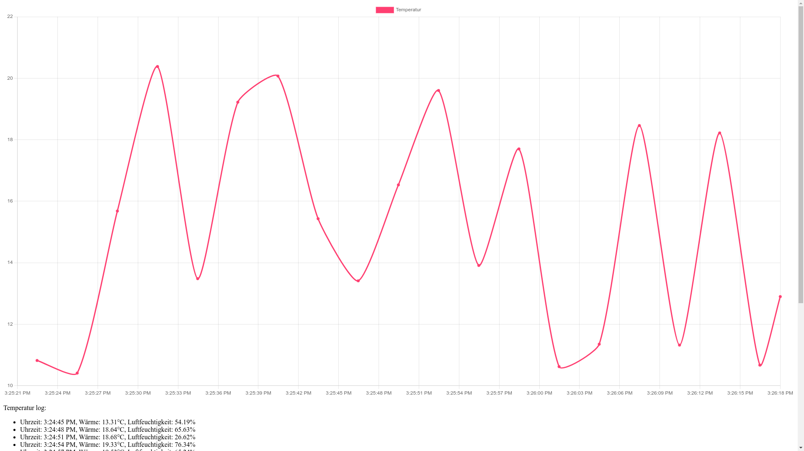

# Node Temperatur

## Info

Programm streamt alle 5 Sekunden die aktuelle Temperatur an alle Clients.

## Installieren:

1. (Node.js 16.14.0 LTS oder neuer)[https://nodejs.org/] installieren
2. Ordner im Terminal öffnen
3. Abhängigkeiten installieren: `corepack yarn`
4. Programm starten: `node .` oder `node ./dist/index.mjs`
5. In Konsole ausgegebenen Link öffnen
6. Wenn auf Raspberry Pi ausgeführt werden soll, muss der TEST Wert in der `./.env` Datei auf `false` gesetzt werden!

## Code lesen
1. Hauptdatei ist id `./src/index.mts` Datei.
2. Dateien können module und andere Dateien bzw. Funktionen aus Dateien importieren. Folge einfach dem Pfad. ACHTUNG: `*.mts` Dateien werden mit `*.mjs` in den Imports angegeben.
3. Der Quellcode ist mit Kommentaren versehen